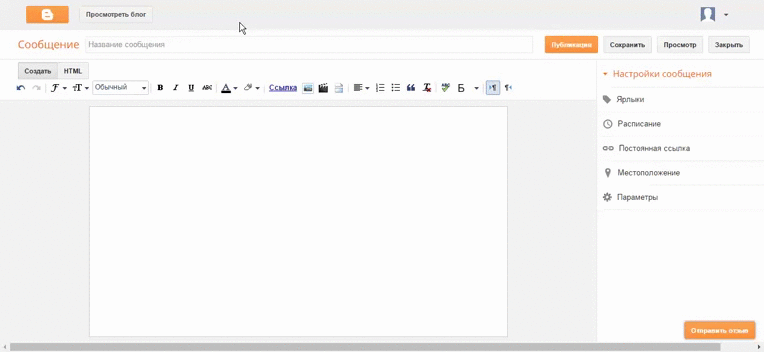

# Использование



# Структура проекта

Файлы и папки относящиеся непосредственно к расширению для браузера:

- [icon16.png](icon16.png)
- [icon48.png](icon48.png)
- [icon128.png](icon128.png)
- [manifest.json](manifest.json)
- [translit.js](translit.js)

# Сборка

```bash
$ ./build.sh
```

Результирующий файл: *BloggerTranslitTitle-#.#.#.#.zip*
